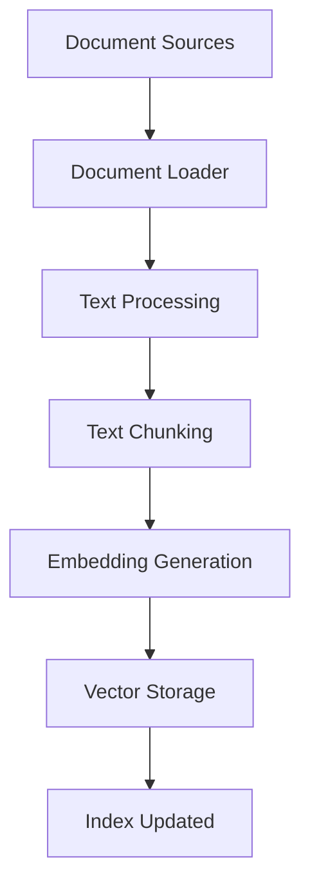
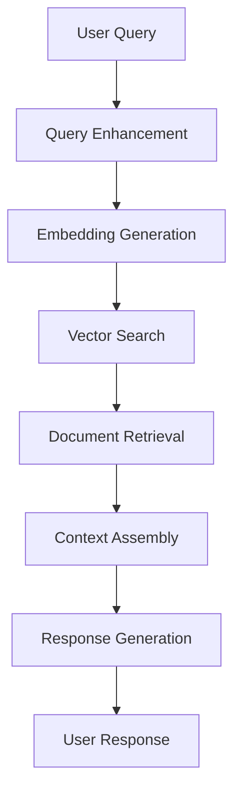
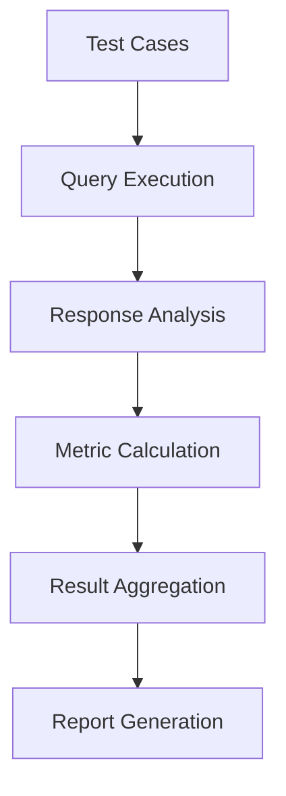

# Data Flow

This document describes how data moves through the RAG System during different operations.

## Indexing Flow

When documents are added to the system, they follow this path:

### Detailed Steps

1. **Document Loading**
   - Files are read from the filesystem
   - Web content is fetched and parsed
   - Data is converted to a common Document format

2. **Text Processing**
   - Text is cleaned and normalized
   - Metadata is extracted and standardized
   - Documents are prepared for chunking

3. **Text Chunking**
   - Large documents are split into smaller chunks
   - Overlap is maintained between chunks for context
   - Each chunk retains document metadata

4. **Embedding Generation**
   - Each chunk is converted to an embedding vector
   - Embeddings are generated using configured provider
   - Quality checks are performed on embeddings

5. **Vector Storage**
   - Embeddings and document chunks are stored
   - Indexes are updated for efficient retrieval
   - Metadata is stored with chunks

## Query Flow

When a user submits a query, it follows this path:

### Detailed Steps

1. **Query Enhancement**
   - Query is parsed and analyzed
   - Additional context may be added
   - Query is prepared for embedding

2. **Embedding Generation**
   - Query is converted to embedding vector
   - Same embedding model used during indexing
   - Embedding quality is validated

3. **Vector Search**
   - Similarity search in vector database
   - Top-k most similar documents retrieved
   - Results are scored by similarity

4. **Document Retrieval**
   - Full document content is fetched
   - Metadata is included with results
   - Documents are prepared for context

5. **Context Assembly**
   - Retrieved documents are formatted as context
   - Context is optimized for LLM consumption
   - Prompt is constructed with query and context

6. **Response Generation**
   - LLM generates response using prompt
   - Response is validated and formatted
   - Confidence scores are calculated

7. **User Response**
   - Final response is returned to user
   - Metadata and source documents included
   - Performance metrics are recorded

## Evaluation Flow

When evaluating system performance:

### Detailed Steps

1. **Test Case Loading**
   - Test cases are loaded from file
   - Expected answers are parsed
   - Context documents are prepared

2. **Query Execution**
   - Each test query is processed
   - Responses are generated for all test cases
   - Performance metrics are collected

3. **Response Analysis**
   - Generated answers are compared to expected answers
   - Various metrics are calculated (accuracy, relevance, etc.)
   - Individual test results are recorded

4. **Metric Calculation**
   - Overall scores are computed
   - Statistical analysis is performed
   - Comparisons between test runs are made

5. **Result Aggregation**
   - All results are compiled
   - Summary statistics are generated
   - Recommendations are formulated

6. **Report Generation**
   - Evaluation report is created
   - Results are formatted for presentation
   - Output is saved to file or displayed

For information on the system's design patterns, see [Design Patterns](design-patterns.md).