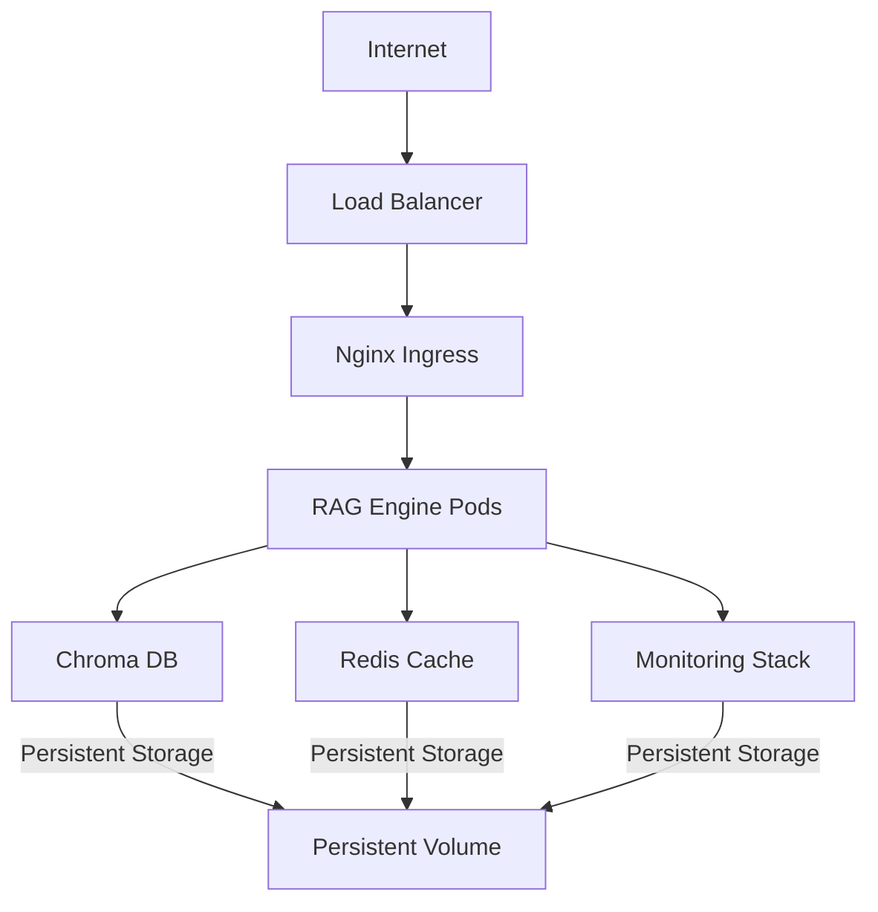

# Kubernetes Deployment

This guide covers deploying the RAG Engine on Kubernetes for scalable, production-grade deployments.

## Overview

The RAG System is designed for deployment on Kubernetes, leveraging its capabilities for orchestration, scaling, and high availability. This guide provides detailed instructions and configurations for a robust Kubernetes deployment.

## Prerequisites

### Cluster Requirements

*   **Kubernetes Version**: 1.24+ is recommended for full feature compatibility.
*   **Node Resources**: Ensure your cluster nodes have sufficient CPU and RAM (e.g., minimum 3 nodes with 4 CPU, 8GB RAM each) to handle the RAG Engine and its dependencies.
*   **Storage**: Dynamic provisioning with performant storage classes (e.g., SSD-backed) is essential for the vector database and other persistent volumes.
*   **Networking**: A Container Network Interface (CNI) plugin (e.g., Calico, Flannel, Weave) must be installed and configured.
*   **Ingress Controller**: An Ingress Controller (e.g., Nginx Ingress Controller) is required to expose the RAG API to external traffic.

### Required Tools

Ensure you have the following command-line tools installed and configured to interact with your Kubernetes cluster:

*   **`kubectl`**: The Kubernetes command-line tool.
    ```bash
    # Example installation for Linux (refer to Kubernetes docs for other OS)
    curl -LO "https://dl.k8s.io/release/$(curl -L -s https://dl.k8s.io/release/stable.txt)/bin/linux/amd64/kubectl"
    chmod +x kubectl
    sudo mv kubectl /usr/local/bin/
    ```
*   **`helm` (optional)**: The Kubernetes package manager, useful for managing complex applications.
    ```bash
    # Example Helm installation
    curl https://raw.githubusercontent.com/helm/helm/main/scripts/get-helm-3 | bash
    ```

**Verify Cluster Access:**
```bash
kubectl cluster-info
kubectl get nodes
```

## Quick Deployment

### Automated Deployment

For a streamlined deployment process, use the provided deployment script:

```bash
# Clone repository
git clone <repository-url>
cd rag-engine # Or your project root directory

# Deploy to Kubernetes
./deployment/scripts/deploy.sh kubernetes

# Check deployment status
kubectl get all -n rag-engine
```

### Manual Deployment

If you prefer to deploy components manually, follow these steps:

1.  **Create Namespace**:
    ```bash
kubectl apply -f deployment/k8s/namespace.yaml
    ```

2.  **Create Secrets**:
    Update the secret values with your actual API keys and passwords, then apply.
    ```bash
kubectl create secret generic rag-engine-secrets \
  --from-literal=GOOGLE_API_KEY=your_google_api_key \
  --from-literal=GRAFANA_PASSWORD=your_grafana_password \
  -n rag-engine
    ```

3.  **Deploy Services**:
    Apply the Kubernetes manifests for each component:
    ```bash
kubectl apply -f deployment/k8s/configmap.yaml
kubectl apply -f deployment/k8s/redis-deployment.yaml
kubectl apply -f deployment/k8s/chroma-deployment.yaml
kubectl apply -f deployment/k8s/rag-engine-deployment.yaml
kubectl apply -f deployment/k8s/nginx-deployment.yaml
kubectl apply -f deployment/k8s/monitoring.yaml
    ```

4.  **Wait for Deployments**:
    ```bash
kubectl wait --for=condition=available --timeout=300s deployment --all -n rag-engine
    ```

## Architecture Overview

### Service Topology

The RAG Engine deployment on Kubernetes typically follows this topology:



### Resource Distribution

An example of resource distribution across key components:

| Component | Replicas | CPU Request | Memory Request | Storage |
|-----------|----------|-------------|----------------|---------|
| RAG Engine | 3 | 500m | 1Gi | - |
| Chroma | 1 | 250m | 512Mi | 20Gi |
| Redis | 1 | 100m | 256Mi | 5Gi |
| Nginx | 2 | 100m | 128Mi | - |
| Prometheus | 1 | 500m | 1Gi | 50Gi |
| Grafana | 1 | 100m | 256Mi | 5Gi |

## Configuration Management

### Secrets Management

Sensitive information like API keys and passwords should be managed securely using Kubernetes Secrets.

#### Creating Secrets

```bash
# API Keys (replace with your actual values)
kubectl create secret generic rag-engine-secrets \
  --from-literal=GOOGLE_API_KEY="your_google_api_key" \
  --from-literal=COHERE_API_KEY="your_cohere_api_key" \
  --from-literal=GRAFANA_PASSWORD="secure_password" \
  -n rag-engine

# SSL Certificates
kubectl create secret tls ssl-certs \
  --cert=path/to/your/cert.pem \
  --key=path/to/your/key.pem \
  -n rag-engine

# Verify secrets are created
kubectl get secrets -n rag-engine
```

#### External Secrets (Recommended for Production)

For enhanced security and integration with existing infrastructure, consider using external secret management solutions like HashiCorp Vault, AWS Secrets Manager, or Azure Key Vault, integrated via tools like External Secrets Operator.

```yaml
# Example ExternalSecret configuration (requires External Secrets Operator)
apiversion: external-secrets.io/v1beta1
kind: SecretStore
metadata:
  name: vault-backend
  namespace: rag-engine
spec:
  provider:
    vault:
      server: "https://vault.example.com"
      path: "secret"
      version: "v2"
      auth:
        kubernetes:
          mountPath: "kubernetes"
          role: "rag-engine"

---
apiversion: external-secrets.io/v1beta1
kind: ExternalSecret
metadata:
  name: rag-engine-secrets
  namespace: rag-engine
spec:
  refreshInterval: 1h
  secretStoreRef:
    name: vault-backend
    kind: SecretStore
  target:
    name: rag-engine-secrets
    creationPolicy: Owner
  data:
  - secretKey: GOOGLE_API_KEY
    remoteRef:
      key: rag-engine
      property: google_api_key
```

### ConfigMaps

Non-sensitive configuration data is managed using Kubernetes ConfigMaps.

```yaml
# Enhanced ConfigMap example
apiversion: v1
kind: ConfigMap
metadata:
  name: rag-engine-config
  namespace: rag-engine
data:
  # Application Configuration
  ENVIRONMENT: "production"
  LOG_LEVEL: "INFO"
  WORKERS: "4"
  
  # Service Discovery
  CHROMA_HOST: "chroma-service" # Service name for inter-service communication
  CHROMA_PORT: "8000"
  REDIS_URL: "redis://redis-service:6379"
  
  # Performance Tuning
  MAX_CONCURRENT_REQUESTS: "100"
  CACHE_TTL: "3600"
  CHUNK_SIZE: "1000"
  RETRIEVAL_K: "5"
  
  # Feature Flags
  ENABLE_RERANKING: "true"
  ENABLE_MONITORING: "true"
  ENABLE_CACHING: "true"
```

## Deployment Configurations

### RAG Engine Deployment

This manifest defines the deployment for the RAG Engine application pods.

```yaml
apiversion: apps/v1
kind: Deployment
metadata:
  name: rag-engine
  namespace: rag-engine
  labels:
    app: rag-engine
    version: v1
spec:
  replicas: 3 # Number of desired replicas for horizontal scaling
  strategy:
    type: RollingUpdate # Strategy for updating pods
    rollingUpdate:
      maxSurge: 1
      maxUnavailable: 0
  selector:
    matchLabels:
      app: rag-engine
  template:
    metadata:
      labels:
        app: rag-engine
        version: v1
      annotations:
        prometheus.io/scrape: "true" # Enable Prometheus scraping
        prometheus.io/port: "8089"
        prometheus.io/path: "/metrics"
    spec:
      serviceAccountName: rag-engine
      securityContext:
        runAsNonRoot: true
        runAsUser: 1000
        fsGroup: 1000
      containers:
      - name: rag-engine
        image: rag-engine:latest # Ensure this image is built and available
        imagePullPolicy: Always
        ports:
        - containerPort: 8000
          name: api
          protocol: TCP
        - containerPort: 8089
          name: metrics
          protocol: TCP
        env:
        - name: POD_NAME
          valueFrom:
            fieldRef:
              fieldPath: metadata.name
        - name: POD_NAMESPACE
          valueFrom:
            fieldRef:
              fieldPath: metadata.namespace
        - name: GOOGLE_API_KEY # Example of injecting secret
          valueFrom:
            secretKeyRef:
              name: rag-engine-secrets
              key: GOOGLE_API_KEY
        envFrom:
        - configMapRef:
            name: rag-engine-config # Inject ConfigMap as environment variables
        resources:
          requests:
            memory: "1Gi"
            cpu: "500m"
            ephemeral-storage: "1Gi"
          limits:
            memory: "2Gi"
            cpu: "1000m"
            ephemeral-storage: "2Gi"
        livenessProbe:
          httpGet:
            path: /health
            port: 8089
          initialDelaySeconds: 30
          periodSeconds: 10
          timeoutSeconds: 5
          failureThreshold: 3
        readinessProbe:
          httpGet:
            path: /health
            port: 8089
          initialDelaySeconds: 10
          periodSeconds: 5
          timeoutSeconds: 3
          failureThreshold: 2
        startupProbe:
          httpGet:
            path: /health
            port: 8089
          initialDelaySeconds: 10
          periodSeconds: 10
          timeoutSeconds: 5
          failureThreshold: 30
        volumeMounts:
        - name: data-volume
          mountPath: /app/data
        - name: logs-volume
          mountPath: /app/logs
        - name: tmp-volume
          mountPath: /tmp
      volumes:
      - name: data-volume
        persistentVolumeClaim:
          claimName: rag-engine-data-pvc
      - name: logs-volume
        persistentVolumeClaim:
          claimName: rag-engine-logs-pvc
      - name: tmp-volume
        emptyDir: {}
      affinity:
        podAntiAffinity:
          preferredDuringSchedulingIgnoredDuringExecution:
          - weight: 100
            podAffinityTerm:
              labelSelector:
                matchExpressions:
                - key: app
                  operator: In
                  values:
                  - rag-engine
              topologyKey: kubernetes.io/hostname
      tolerations:
      - key: "rag-engine"
        operator: "Equal"
        value: "true"
        effect: "NoSchedule"
```

### Service Account and RBAC

Define a Service Account and Role-Based Access Control (RBAC) to grant necessary permissions to the RAG Engine pods.

```yaml
apiversion: v1
kind: ServiceAccount
metadata:
  name: rag-engine
  namespace: rag-engine

---
apiversion: rbac.authorization.k8s.io/v1
kind: Role
metadata:
  namespace: rag-engine
  name: rag-engine-role
rules:
- apiGroups: [""]
  resources: ["pods", "services", "endpoints"]
  verbs: ["get", "list", "watch"]
- apiGroups: ["apps"]
  resources: ["deployments", "replicasets"]
  verbs: ["get", "list", "watch"]

---
apiversion: rbac.authorization.k8s.io/v1
kind: RoleBinding
metadata:
  name: rag-engine-rolebinding
  namespace: rag-engine
subjects:
- kind: ServiceAccount
  name: rag-engine
  namespace: rag-engine
roleRef:
  kind: Role
  name: rag-engine-role
  apiGroup: rbac.authorization.k8s.io
```

## Storage Configuration

Persistent storage for the RAG Engine, ChromaDB, Prometheus, and Grafana is managed using Persistent Volumes (PVs) and Persistent Volume Claims (PVCs).

### Storage Classes

Define Storage Classes appropriate for your cloud provider or on-premises setup.

```yaml
# Example: Fast SSD Storage Class for AWS EBS
apiversion: storage.k8s.io/v1
kind: StorageClass
metadata:
  name: fast-ssd
provisioner: kubernetes.io/aws-ebs # Adjust for your cloud provider (e.g., gce-pd, azure-disk)
parameters:
  type: gp3 # General Purpose SSD
  iops: "3000"
  throughput: "125"
  encrypted: "true"
volumeBindingMode: WaitForFirstConsumer # Delay volume binding until a Pod is scheduled
allowVolumeExpansion: true

---
# Example: Standard Storage Class
apiversion: storage.k8s.io/v1
kind: StorageClass
metadata:
  name: standard
provisioner: kubernetes.io/aws-ebs
parameters:
  type: gp2
  encrypted: "true"
volumeBindingMode: WaitForFirstConsumer
allowVolumeExpansion: true
```

### Persistent Volume Claims

Create PVCs to request storage for each component.

```yaml
# RAG Engine Data PVC
apiversion: v1
kind: PersistentVolumeClaim
metadata:
  name: rag-engine-data-pvc
  namespace: rag-engine
spec:
  accessModes:
    - ReadWriteOnce # Can be mounted as read-write by a single node
  resources:
    requests:
      storage: 10Gi
  storageClassName: fast-ssd

---
# Chroma Database PVC
apiversion: v1
kind: PersistentVolumeClaim
metadata:
  name: chroma-data-pvc
  namespace: rag-engine
spec:
  accessModes:
    - ReadWriteOnce
  resources:
    requests:
      storage: 50Gi
  storageClassName: fast-ssd

---
# Prometheus Data PVC
apiversion: v1
kind: PersistentVolumeClaim
metadata:
  name: prometheus-data-pvc
  namespace: rag-engine
spec:
  accessModes:
    - ReadWriteOnce
  resources:
    requests:
      storage: 100Gi
  storageClassName: fast-ssd
```

## Networking and Ingress

### Service Configuration

Kubernetes Services expose your applications running in Pods. `ClusterIP` is typically used for internal communication.

```yaml
# RAG Engine Service
apiversion: v1
kind: Service
metadata:
  name: rag-engine-service
  namespace: rag-engine
  labels:
    app: rag-engine
  annotations:
    prometheus.io/scrape: "true" # Annotation for Prometheus auto-discovery
    prometheus.io/port: "8089"
    prometheus.io/path: "/metrics"
spec:
  selector:
    app: rag-engine # Selects pods with this label
  ports:
  - name: api
    port: 8000 # Service port
    targetPort: 8000 # Pod port
    protocol: TCP
  - name: metrics
    port: 8089
    targetPort: 8089
    protocol: TCP
  type: ClusterIP # Internal service, accessible only within the cluster
  sessionAffinity: None
```

### Ingress Configuration

Ingress manages external access to services in a cluster, typically providing HTTP and HTTPS routing.

```yaml
apiversion: networking.k8s.io/v1
kind: Ingress
metadata:
  name: rag-engine-ingress
  namespace: rag-engine
  annotations:
    kubernetes.io/ingress.class: "nginx" # Specify Ingress Controller
    cert-manager.io/cluster-issuer: "letsencrypt-prod" # For automatic SSL certificates
    nginx.ingress.kubernetes.io/rate-limit: "100" # Rate limiting example
    nginx.ingress.kubernetes.io/rate-limit-window: "1m"
    nginx.ingress.kubernetes.io/proxy-body-size: "10m"
    nginx.ingress.kubernetes.io/proxy-connect-timeout: "30"
    nginx.ingress.kubernetes.io/proxy-send-timeout: "60"
    nginx.ingress.kubernetes.io/proxy-read-timeout: "60"
    nginx.ingress.kubernetes.io/ssl-redirect: "true"
    nginx.ingress.kubernetes.io/force-ssl-redirect: "true"
spec:
  tls:
  - hosts:
    - api.yourdomain.com
    - monitoring.yourdomain.com
    secretName: rag-engine-tls # Secret containing TLS certificate
  rules:
  - host: api.yourdomain.com
    http:
      paths:
      - path: /api
        pathType: Prefix
        backend:
          service:
            name: rag-engine-service
            port:
              number: 8000
      - path: /health
        pathType: Prefix
        backend:
          service:
            name: rag-engine-service
            port:
              number: 8089
  - host: monitoring.yourdomain.com
    http:
      paths:
      - path: / # Route to Grafana dashboard
        pathType: Prefix
        backend:
          service:
            name: grafana-service
            port:
              number: 3000
```

## Auto-scaling

Kubernetes provides powerful auto-scaling capabilities to adjust resources based on demand.

### Horizontal Pod Autoscaler (HPA)

HPA automatically scales the number of pod replicas based on observed CPU utilization, memory usage, or custom metrics.

```yaml
apiversion: autoscaling/v2
kind: HorizontalPodAutoscaler
metadata:
  name: rag-engine-hpa
  namespace: rag-engine
spec:
  scaleTargetRef:
    apiVersion: apps/v1
    kind: Deployment
    name: rag-engine
  minReplicas: 3 # Minimum number of pods
  maxReplicas: 20 # Maximum number of pods
  metrics:
  - type: Resource
    resource:
      name: cpu
      target:
        type: Utilization
        averageUtilization: 70 # Target CPU utilization percentage
  - type: Resource
    resource:
      name: memory
      target:
        type: Utilization
        averageUtilization: 80
  - type: Pods # Example of custom metric scaling
    pods:
      metric:
        name: rag_engine_requests_per_second
      target:
        type: AverageValue
        averageValue: "100" # Target average requests per second per pod
  behavior:
    scaleDown:
      stabilizationWindowSeconds: 300
      policies:
      - type: Percent
        value: 10
        periodSeconds: 60
    scaleUp:
      stabilizationWindowSeconds: 60
      policies:
      - type: Percent
        value: 50
        periodSeconds: 60
      - type: Pods
        value: 2
        periodSeconds: 60
      selectPolicy: Max
```

### Vertical Pod Autoscaler (VPA)

VPA automatically adjusts the CPU and memory requests and limits for containers based on their actual usage, optimizing resource allocation.

```yaml
apiversion: autoscaling.k8s.io/v1
kind: VerticalPodAutoscaler
metadata:
  name: rag-engine-vpa
  namespace: rag-engine
spec:
  targetRef:
    apiVersion: apps/v1
    kind: Deployment
    name: rag-engine
  updatePolicy:
    updateMode: "Auto" # VPA automatically applies recommendations
  resourcePolicy:
    containerPolicies:
    - containerName: rag-engine
      minAllowed:
        cpu: 100m
        memory: 512Mi
      maxAllowed:
        cpu: 2000m
        memory: 4Gi
      controlledResources: ["cpu", "memory"]
```

### Cluster Autoscaler

Cluster Autoscaler automatically adjusts the number of nodes in your Kubernetes cluster based on the pending pods and node utilization.

```yaml
# Example node pool configuration for AWS EKS (managed node groups)
# This is typically configured outside of direct Kubernetes manifests
apiversion: v1
kind: ConfigMap
metadata:
  name: cluster-autoscaler-status
  namespace: kube-system
data:
  nodes.max: "20" # Maximum number of nodes in the cluster
  nodes.min: "3"  # Minimum number of nodes
  scale-down-delay-after-add: "10m"
  scale-down-unneeded-time: "10m"
```

## Monitoring and Observability

Integrate with Prometheus and Grafana for comprehensive monitoring of your RAG Engine.

### Prometheus Configuration

This ConfigMap defines the Prometheus configuration, including scrape jobs for the RAG Engine and Kubernetes components.

```yaml
apiversion: v1
kind: ConfigMap
metadata:
  name: prometheus-config
  namespace: rag-engine
data:
  prometheus.yml: |
    global:
      scrape_interval: 15s
      evaluation_interval: 15s
      external_labels:
        cluster: 'rag-engine-k8s'
        environment: 'production'

    rule_files:
      - "/etc/prometheus/rules/*.yml"

    scrape_configs:
      # RAG Engine metrics
      - job_name: 'rag-engine'
        kubernetes_sd_configs:
        - role: endpoints
          namespaces:
            names:
            - rag-engine
        relabel_configs:
        - source_labels: [__meta_kubernetes_service_annotation_prometheus_io_scrape]
          action: keep
          regex: true
        - source_labels: [__meta_kubernetes_service_annotation_prometheus_io_path]
          action: replace
          target_label: __metrics_path__
          regex: (.+)
        - source_labels: [__address__, __meta_kubernetes_service_annotation_prometheus_io_port]
          action: replace
          regex: ([^:]+)(?::\d+)?;(\d+)
          replacement: $1:$2
          target_label: __address__

      # Kubernetes cluster metrics (example for API server)
      - job_name: 'kubernetes-apiservers'
        kubernetes_sd_configs:
        - role: endpoints
          scheme: https
          tls_config:
            ca_file: /var/run/secrets/kubernetes.io/serviceaccount/ca.crt
        bearer_token_file: /var/run/secrets/kubernetes.io/serviceaccount/token
        relabel_configs:
        - source_labels: [__meta_kubernetes_namespace, __meta_kubernetes_service_name, __meta_kubernetes_endpoint_port_name]
          action: keep
          regex: default;kubernetes;https

      # Node metrics (example)
      - job_name: 'kubernetes-nodes'
        kubernetes_sd_configs:
        - role: node
          scheme: https
          tls_config:
            ca_file: /var/run/secrets/kubernetes.io/serviceaccount/ca.crt
        bearer_token_file: /var/run/secrets/kubernetes.io/serviceaccount/token
        relabel_configs:
        - action: labelmap
          regex: __meta_kubernetes_node_label_(.+)

    alerting:
      alertmanagers:
      - kubernetes_sd_configs:
        - role: pod
          namespaces:
            names:
            - rag-engine
        relabel_configs:
        - source_labels: [__meta_kubernetes_pod_label_app]
          action: keep
          regex: alertmanager
```

### Alert Rules

Define Prometheus Alertmanager rules to notify on critical events.

```yaml
apiversion: v1
kind: ConfigMap
metadata:
  name: prometheus-rules
  namespace: rag-engine
data:
  rag-engine.yml: |
    groups:
    - name: rag-engine
      rules:
      - alert: RAGEngineDown
        expr: up{job="rag-engine"} == 0
        for: 1m
        labels:
          severity: critical
        annotations:
          summary: "RAG Engine instance is down"
          description: "RAG Engine instance {{ $labels.instance }} has been down for more than 1 minute."

      - alert: RAGEngineHighErrorRate
        expr: rate(rag_engine_requests_total{status=~"5.."}[5m]) > 0.1
        for: 2m
        labels:
          severity: warning
        annotations:
          summary: "High error rate in RAG Engine"
          description: "RAG Engine error rate is {{ $value }} errors per second."

      - alert: RAGEngineHighLatency
        expr: histogram_quantile(0.95, rate(rag_engine_request_duration_seconds_bucket[5m])) > 2
        for: 5m
        labels:
          severity: warning
        annotations:
          summary: "High latency in RAG Engine"
          description: "RAG Engine 95th percentile latency is {{ $value }} seconds."

      - alert: RAGEngineHighMemoryUsage
        expr: container_memory_usage_bytes{pod=~"rag-engine-.*"} / container_spec_memory_limit_bytes > 0.9
        for: 5m
        labels:
          severity: warning
        annotations:
          summary: "High memory usage in RAG Engine"
          description: "RAG Engine pod {{ $labels.pod }} memory usage is above 90%."

      - alert: ChromaDBDown
        expr: up{job="chroma"} == 0
        for: 1m
        labels:
          severity: critical
        annotations:
          summary: "Chroma database is down"
          description: "Chroma database has been down for more than 1 minute."

      - alert: RedisDown
        expr: up{job="redis"} == 0
        for: 1m
        labels:
          severity: critical
        annotations:
          summary: "Redis cache is down"
          description: "Redis cache has been down for more than 1 minute."
```

## Security

Implement Kubernetes security best practices to protect your deployment.

### Pod Security Standards

Apply Pod Security Standards to namespaces to enforce security policies.

```yaml
apiversion: v1
kind: Namespace
metadata:
  name: rag-engine
  labels:
    pod-security.kubernetes.io/enforce: restricted # Enforce restricted policy
    pod-security.kubernetes.io/audit: restricted
    pod-security.kubernetes.io/warn: restricted
```

### Network Policies

Network Policies control traffic flow between pods and network endpoints.

```yaml
apiversion: networking.k8s.io/v1
kind: NetworkPolicy
metadata:
  name: rag-engine-network-policy
  namespace: rag-engine
spec:
  podSelector:
    matchLabels:
      app: rag-engine
  policyTypes:
  - Ingress
  - Egress
  ingress:
  - from:
    - namespaceSelector:
        matchLabels:
          name: ingress-nginx # Allow ingress from Nginx Ingress Controller
    - podSelector:
        matchLabels:
          app: nginx
    ports:
    - protocol: TCP
      port: 8000 # Allow API traffic
    - protocol: TCP
      port: 8089 # Allow metrics/health traffic
  egress:
  - to:
    - podSelector:
        matchLabels:
          app: chroma # Allow egress to ChromaDB
    ports:
    - protocol: TCP
      port: 8000
  - to:
    - podSelector:
        matchLabels:
          app: redis # Allow egress to Redis
    ports:
    - protocol: TCP
      port: 6379
  - to: [] # Allow external API calls (e.g., to LLM providers)
    ports:
    - protocol: TCP
      port: 443
```

### Security Context

Define security contexts for pods and containers to restrict privileges.

```yaml
securityContext:
  runAsNonRoot: true # Run as non-root user
  runAsUser: 1000
  runAsGroup: 1000
  fsGroup: 1000
  seccompProfile:
    type: RuntimeDefault # Use default seccomp profile
  capabilities:
    drop:
    - ALL # Drop all capabilities
  allowPrivilegeEscalation: false
  readOnlyRootFilesystem: true # Mount root filesystem as read-only
```

## Backup and Disaster Recovery

Implement a robust backup and disaster recovery strategy for your Kubernetes deployment.

### Backup Strategy

Tools like Velero can be used to back up Kubernetes resources and persistent volumes.

```yaml
# Velero backup configuration example
apiversion: velero.io/v1
kind: Backup
metadata:
  name: rag-engine-backup
  namespace: velero
spec:
  includedNamespaces:
  - rag-engine # Namespace to back up
  storageLocation: default
  ttl: 720h0m0s # 30 days retention
  includedResources:
  - persistentvolumes
  - persistentvolumeclaims
  - secrets
  - configmaps
  hooks:
    resources:
    - name: chroma-backup-hook # Example hook for ChromaDB
      includedNamespaces:
      - rag-engine
      labelSelector:
        matchLabels:
          app: chroma
      pre:
      - exec:
          container: chroma
          command:
          - /bin/sh
          - -c
          - "tar -czf /tmp/chroma-backup.tar.gz /chroma/chroma" # Command to backup Chroma data
      post:
      - exec:
          container: chroma
          command:
          - /bin/sh
          - -c
          - "rm -f /tmp/chroma-backup.tar.gz"
```

### Disaster Recovery Plan

1.  **Automated Backups**: Schedule regular backups using Kubernetes CronJobs or Velero schedules.
    ```bash
    # Example CronJob for daily Velero backup
    kubectl create cronjob rag-engine-backup \
      --image=velero/velero:latest \
      --schedule="0 2 * * *" \
      --restart=OnFailure \
      -- velero backup create rag-engine-$(date +%Y%m%d)
    ```

2.  **Cross-Region Replication**: Configure your storage solution for cross-region replication of persistent volumes.

3.  **Recovery Procedures**: Document and regularly test your recovery procedures.
    ```bash
    # Example restore from backup
    velero restore create --from-backup rag-engine-20240101
    
    # Verify restoration
    kubectl get all -n rag-engine
    ```

## Troubleshooting

### Common Issues

1.  **Pod Startup Issues**: Pods failing to start or crashing.
    *   **Solution**: Check pod status (`kubectl get pods`), describe the pod (`kubectl describe pod <pod-name>`), and view logs (`kubectl logs <pod-name>`). Also check events (`kubectl get events`).

2.  **Resource Issues**: Pods being OOMKilled or throttled.
    *   **Solution**: Check resource usage (`kubectl top pods`), review resource requests/limits in deployment manifests, and check cluster resource quotas.

3.  **Network Issues**: Services unable to communicate.
    *   **Solution**: Test connectivity from within a pod (`kubectl exec -it <pod-name> -- curl <service-url>`), check DNS resolution (`nslookup`), and inspect Network Policies.

4.  **Storage Issues**: PVCs pending or volumes not mounting.
    *   **Solution**: Check PVC status (`kubectl get pvc`), describe the PVC, and verify Storage Class configuration.

### Debug Commands

*   **Comprehensive cluster info**: `kubectl cluster-info dump --namespaces rag-engine --output-directory=./cluster-dump`
*   **Resource consumption**: `kubectl describe nodes`, `kubectl get pods -o wide -n rag-engine`
*   **Network debugging**: Use a debug pod with network tools (`kubectl run debug --image=nicolaka/netshoot -it --rm -- /bin/bash`)
*   **Storage debugging**: `kubectl get pv,pvc -n rag-engine`, `kubectl describe pv <pv-name>`

### Performance Tuning

1.  **Node Optimization**: Label and taint nodes for specific workloads to ensure pods are scheduled on appropriate hardware.
2.  **Resource Optimization**: Use Resource Quotas to limit resource consumption per namespace.
3.  **Scheduling Optimization**: Implement Node Affinity to control where pods are scheduled.

## Maintenance

### Rolling Updates

Kubernetes Deployments support rolling updates to update applications with zero downtime.

```bash
# Update deployment image
kubectl set image deployment/rag-engine rag-engine=rag-engine:v2.0.0 -n rag-engine

# Monitor rollout status
kubectl rollout status deployment/rag-engine -n rag-engine

# Rollback to previous version if needed
kubectl rollout undo deployment/rag-engine -n rag-engine
```

### Cluster Maintenance

*   **Drain Node**: Safely evict all pods from a node for maintenance.
    ```bash
kubectl drain <node-name> --ignore-daemonsets --delete-emptydir-data
    ```
*   **Cordon/Uncordon Node**: Mark a node as unschedulable/schedulable.
    ```bash
kubectl cordon <node-name>
kubectl uncordon <node-name>
    ```

### Automated Maintenance

Use Kubernetes CronJobs to schedule regular maintenance tasks, such as log cleanup or data pruning.

```yaml
# CronJob for cleanup example
apiversion: batch/v1
kind: CronJob
metadata:
  name: cleanup-job
  namespace: rag-engine
spec:
  schedule: "0 2 * * 0" # Weekly at 2 AM
  jobTemplate:
    spec:
      template:
        spec:
          containers:
          - name: cleanup
            image: alpine:latest
            command:
            - /bin/sh
            - -c
            - |
              # Cleanup old logs
              find /app/logs -name "*.log" -mtime +7 -delete
              # Cleanup temporary files
              find /tmp -type f -mtime +1 -delete
            volumeMounts:
            - name: logs-volume
              mountPath: /app/logs
          volumes:
          - name: logs-volume
            persistentVolumeClaim:
              claimName: rag-engine-logs-pvc
          restartPolicy: OnFailure
```